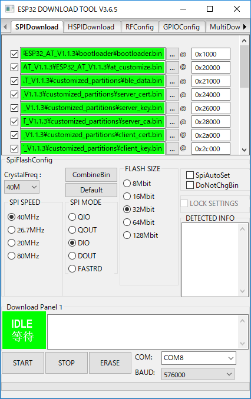

# GR-Boards_ESP32_Serial_Bridge
ESP32(UART)とPC(USB)をブリッジするサンプルプログラムです。  
ESP32の評価やFlash書き込みの際にご利用いただけます。  
GR-LYCHEEはボード上にESP32が搭載されています。  
GR-PEACHは``GR-WIRELESS CAMERA Shield``を接続することでESP32を追加することができます。  

## 使い方
以下のアイテムが`docs\ESP32_firmware.zip`の中に含まれています。
- ``GR-LYCHEE_ESP32_Serial_Bridge.bin`` (GR-LYCHEE用)
- ``GR-PEACH_ESP32_Serial_Bridge.bin`` (GR-PEACH用)
- ``ESP32_firmware`` (ESP32用ファームウェア)

サンプルコードをそのまま使用する場合はプロジェクト内`docs\ESP32_firmware.zip`を展開し、お使いのボードに合わせて``GR-xxxxx_ESP32_Serial_Bridge.bin``をボードに書き込んで使用してください。  

### シリアル設定
``MicroUSBコネクタ(RZ/A1 Ch.0)``をPCと接続して使用します。  

  

Windows10以外ご使用の場合、ドライバのインストールが必要となります。下記サイトのからドライバーをダウンロードできます。  

https://os.mbed.com/handbook/USBSerial

但し、「署名なしドライバ」となっていますので、お使いのWindowsバージョンによってはそのままインストールすることはできません。お使いのPC毎に設定方法が異なるため、検索サイトで「署名なしドライバ」で検索してください。  

ターミナルソフトソフトで通信を確かめる場合は、下記設定で通信してください。  

|            |        |
|:-----------|:-------|
| ボーレート | 115200 |
| データ     | 8bit   |
| パリティ   | none   |
| ストップ   | 1bit   |
| フロー制御 | none   |

### ボタン
`USER_BUTTON0`を押すとESP32にリセットが入ります。  

### ESP32をFlash書き込みモードにする
ESP32を書き込みモードにする際は、`USER_BUTTON0`を押しながらUSBケーブルを接続してください。書き込みモードになるとボード上のLED1が光ります。書き込みモードを解除する場合はもう一度USBケーブルを接続しなおしてください。  

### ESP32ファムウェアのアップデート方法

以下のファーウェアをボードに書き込んでください。
- ``GR-LYCHEE_ESP32_Serial_Bridge.bin`` (GR-LYCHEE用)
- ``GR-PEACH_ESP32_Serial_Bridge.bin`` (GR-PEACH用)

Espressif’s official Flash Download Tools:  
http://espressif.com/en/support/download/other-tools?keys=&field_type_tid%5B%5D=13

  

  

設定は以下の通りです。ターミナルソフトでCOMポートを既に開いている場合は、ターミナルソフトを終了させてください。
* SPI SPEED : ``40MHz``
* SPI MODE : ``DIO``
* FLASH SIZE : ``32Mbit``
* COM : あたなのボードに割り当たったCOM
* BAUD : ``460800`` (書き込みに失敗するようでしたらボーレートを下げてください)  

アップデートファイルは``docs\ESP32_firmware.zip``の中にあります。

|Path                                       |offset  |
|:------------------------------------------|:-------|
|0x1000_bootloader.bin                      |0x1000  |
|0x20000_at_customize.bin                   |0x20000 |
|0x21000_ble_data.bin                       |0x21000 |
|0x24000_server_cert.bin                    |0x24000 |
|0x26000_server_key.bin                     |0x26000 |
|0x28000_server_ca.bin                      |0x28000 |
|0x2a000_client_cert.bin                    |0x2a000 |
|0x2c000_client_key.bin                     |0x2c000 |
|0x2e000_client_ca.bin                      |0x2e000 |
|0x30000_factory_param_lychee_and_peach.bin |0x30000 |
|0xf000_phy_init_data.bin                   |0xf000  |
|0x100000_esp-at.bin                        |0x100000|
|0x8000_partitions_at.bin                   |0x8000  |

手順:  
1. `USER_BUTTON0`を押しながら、PCと``MicroUSB connector Ch.0``をUSBケーブルで接続します。
2. ツールの``Erase``ボタンを押して、フラッシュ上の不要なデータを消去します。 終了すると、ツールの``IDLE``というラベルの付いた緑色の領域が``FINISH``に変わります。
3. USBケーブルを取り外し、再度``USER_BUTTON0``を押しながらUSBケーブルを接続します。
4. ツールの``START``ボタンを押して、書き込みを開始します。 終了すると、ツールの``IDLE``というラベルの付いた緑色の領域が``FINISH``に変わります。
